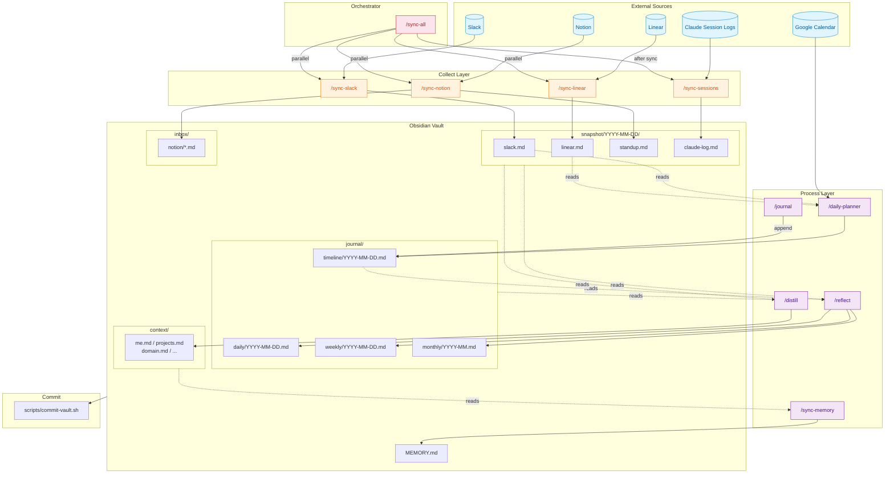

# memex Workflow

## Data Flow Summary

| Layer | Skills | Description |
|-------|--------|-------------|
| **Collect** | sync-slack, sync-linear, sync-notion, sync-sessions | External sources -> snapshot/ |
| **Orchestrate** | sync-all | Runs collect skills in parallel |
| **Capture** | journal, daily-planner | User input + calendar -> journal/ |
| **Synthesize** | reflect, distill | snapshot + journal -> context/ |
| **Maintain** | sync-memory | Keep MEMORY.md consistent |
